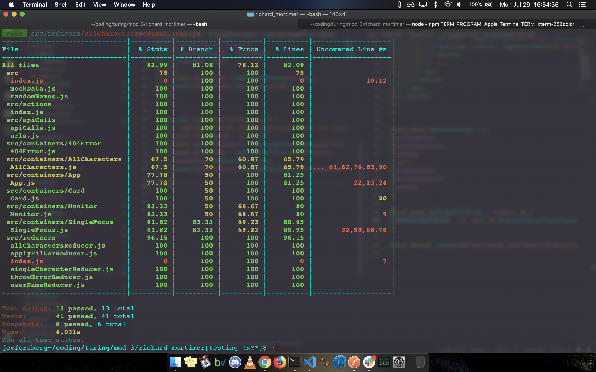
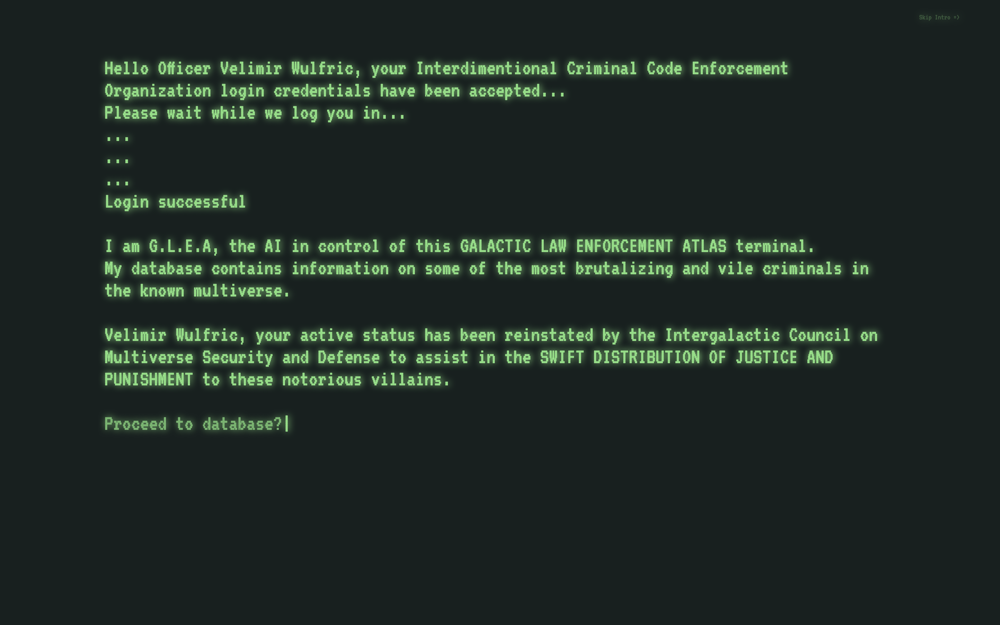
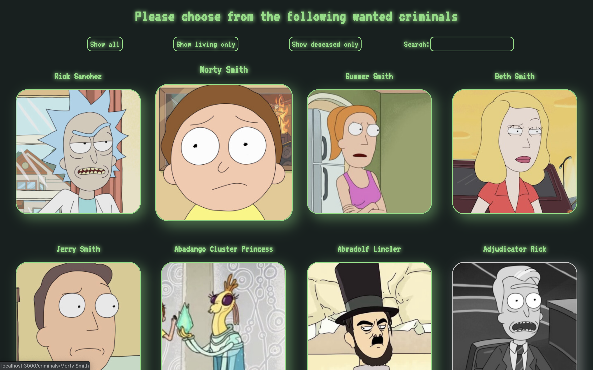
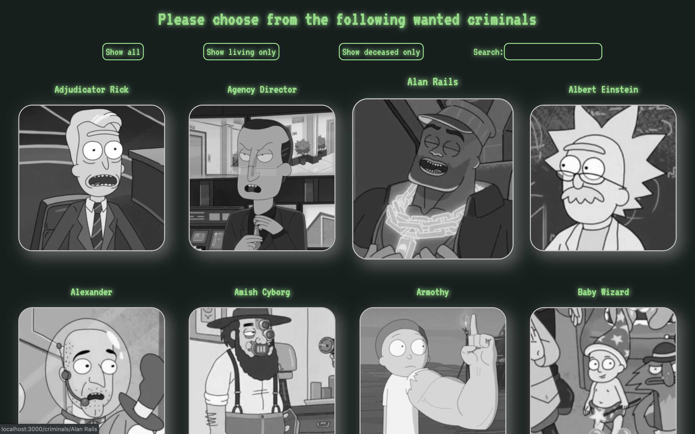
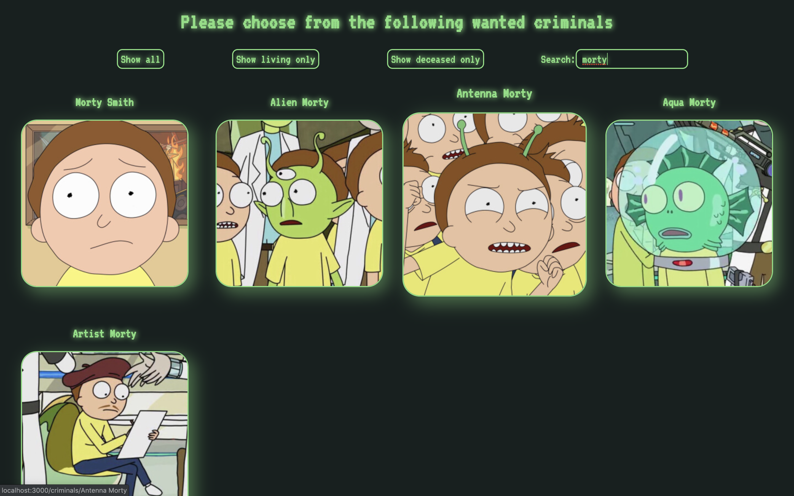
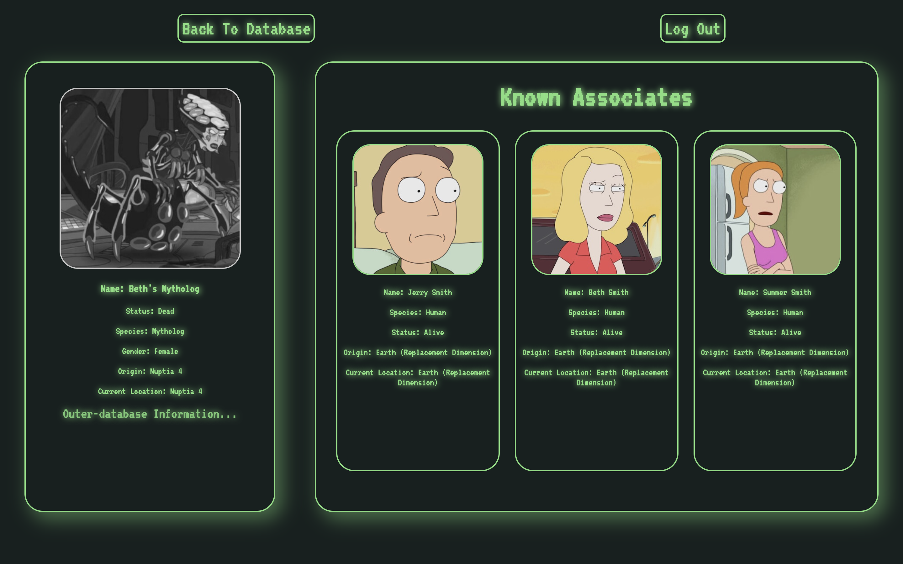
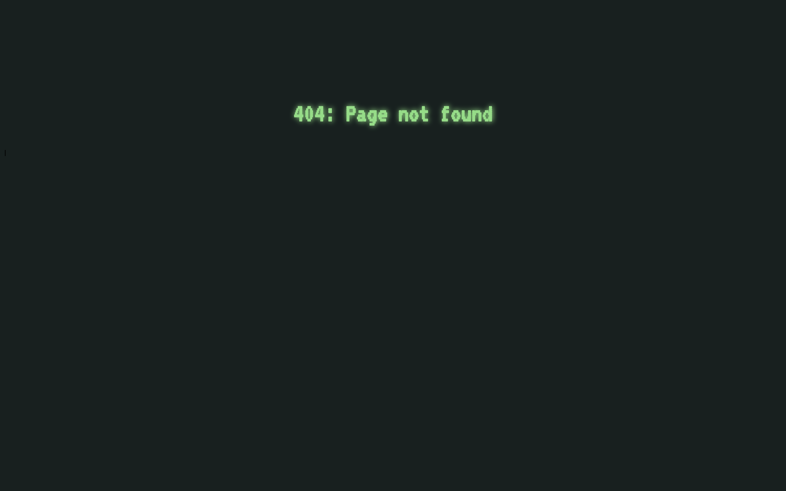

# BetterFlix

## Table of Contents
* [Available Scripts](#Available-Scripts)
* [Description](#Description)
* [Project Successes](Project-Successes)
* [Project Challenges](Project-Challenges)
* [Project Extensions/Issues](Project-Extensions/Issues)
* [Project Tech Emphasis](Project-Tech-Emphasis)
* [Project Management](Project-Management)
* [Project Comps](Project-Comps)
* [Developers](Developers)

## Available Scripts

This project was bootstrapped with [Create React App](https://github.com/facebook/create-react-app).

In the project directory, you can run:

### `npm start`

Runs the app in the development mode. 
Open [http://localhost:3000](http://localhost:3000) to view it in the browser.

The page will reload if you make edits. 
You will also see any lint errors in the console.

### `npm test`

Launches the test runner in the interactive watch mode. 
See the section about [running tests](https://facebook.github.io/create-react-app/docs/running-tests) for more information.

## Test Coverage

## Description

This project is Rick and Morty fan app. With the announcement of R&M Season 4 coming this fall, there's a lot of excitement around it's hottly anticipated release. This app is designed to be a endorsement piece; an attempt to keep up the excitement for the upcoming season. There's a bit of gamification, a bit of shameless plugging of Adult Swim, and a LOT of 80's computer styling.

## Project Successes

This project actually has quite a bit going on behind the scenes. Fetching, typewriter fonts, react-router, 404 error warnings, redux, both functional and class React components, external linking to curated google searches, sorting, filtering, seaching, enzyme testing, etc. But with all of that happening in the background, I think my biggest success was making everything actually WORK together. With so macny moving parts, it felt like a real accomplishment to actually pull everything together.

## Project Challenges

As always, writing modular code required careful planning and strategic architecture. This was also true for my Redux store. Thinking critically about what needed to live in the Redux store vs. local state is always a challenge, as there are pros and cons to both. But in the end, I intentionally sent most data to the store, as not needing local state could keep my components and containers as small and DRY as possible.

## Project Extensions/Issues

* Would love to add R&M specific sounds.
* Create a bounty system where the user can take a bounty (favorite) out on a character.

## Project Tech Emphasis

* HTML
* CSS
* JavaScript
* React
* React Router
* Redux
* Jest
* Enzyme
* PropTypes
* API fetches
* NPM
* Git and GitHub
* React Typist
* PropTypes

## Project Management

I used GitHub issues to manage workflow.

## Project Comps:

### Intro

### All Characters Display

### Filter Deceased

### Search Characters

### Focused Character Display

### 404 Page

### GIFS

## Developers

[Jev Forsberg](https://github.com/baldm0mma)

## Licensing

All credit goes to <a href="turing.io">Turing School of Software</a> for providing the project specifications.